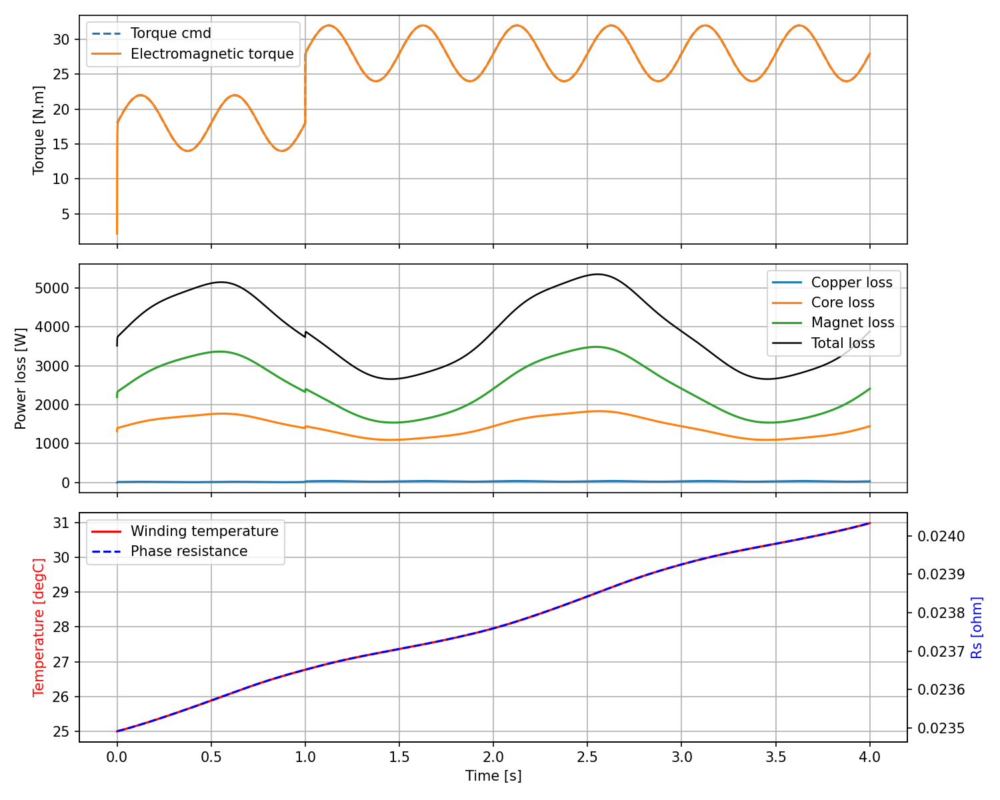

# PMSM 示例项目

本目录包含两条仿真路径：

1. `design_pmsm.py`
- 基于 `dq` 模型的快速表贴式永磁同步电机（SPMSM）仿真。
- 输入包括母线电压、电机几何和材料参数。
- 输出电磁转矩、损耗与温升波形。

2. `femm_spm_template.py`
- 基于 FEMM 的 2D 有限元模板。
- 自动建模 + 转速/负载扫点。
- 输出转矩/损耗/温升波形到 CSV/PNG。

## 目录结构

```text
motor design/
  design_pmsm.py
  femm_spm_template.py
  requirements.txt
  run.ps1
  run.bat
  README.md
  output/
    pmsm_waveforms.csv
    pmsm_waveforms.png
```

## 1）环境准备

如果你使用 conda：

```powershell
conda create -n motor python=3.11 -y
conda activate motor
pip install -r requirements.txt
```

如果 PowerShell 中识别不到 `conda`，先执行一次：

```powershell
D:\miniconda3\Scripts\conda.exe init powershell
```

然后重启 VS Code 和终端。

## 2）快速运行（dq 模型）

PowerShell：

```powershell
.\run.ps1
```

CMD：

```bat
run.bat
```

手动运行：

```powershell
python .\design_pmsm.py --save-csv --save-png --out .\output
```

常用参数：

- `--vdc 540`
- `--dt 5e-5`
- `--t-end 6.0`
- `--no-show`

仿真输出文件（默认在 `output/`）：

- `pmsm_waveforms.csv`
- `pmsm_waveforms.png`

## 3）仿真波形示例（dq 模型）

运行 `design_pmsm.py` 后会生成如下波形图：



## 4）FEMM 有限元模板

前置条件：

1. 安装 FEMM 4.2（Windows）。
2. 安装 `pyfemm`（`pip install pyfemm`）。

运行一次扫点：

```powershell
python .\femm_spm_template.py --rpm-list "1000,1500,2000" --iq-list "15,25,35" --points 72 --out .\output_femm
```

常用选项：

- `--show`：显示 matplotlib 图。
- `--show-femm`：显示 FEMM 图形界面。

输出文件：

- `output_femm/femm_waveforms_*.csv`
- `output_femm/femm_waveforms_*.png`
- `output_femm/femm_summary.csv`

## 5）说明

- `design_pmsm.py` 适合做控制与参数趋势的快速评估。
- `femm_spm_template.py` 更接近场路仿真，但当前仍是模板：
  - 槽型/绕组布置做了简化；
  - 铁耗/磁钢损耗为半经验模型；
  - 若用于工程定型，请替换为真实几何、材料与 B-H 曲线数据。

## 6）FEMM 故障排查

如果 PowerShell 把列表参数拆开，可用以下任一写法：

```powershell
python .\femm_spm_template.py --rpm-list "1000,1500,2000" --iq-list "15,25,35"
```

或

```powershell
python .\femm_spm_template.py --rpm-list 1000 1500 2000 --iq-list 15 25 35
```

如果报错包含 `Invalid class string` 或 `femm.ActiveFEMM`，说明 FEMM COM 未注册。
请在“管理员 CMD”执行：

```bat
"C:\Program Files (x86)\FEMM42\femm.exe" /regserver
reg query HKCR\femm.ActiveFEMM
```

如路径不存在，请改成你本机 FEMM 的实际安装路径。
