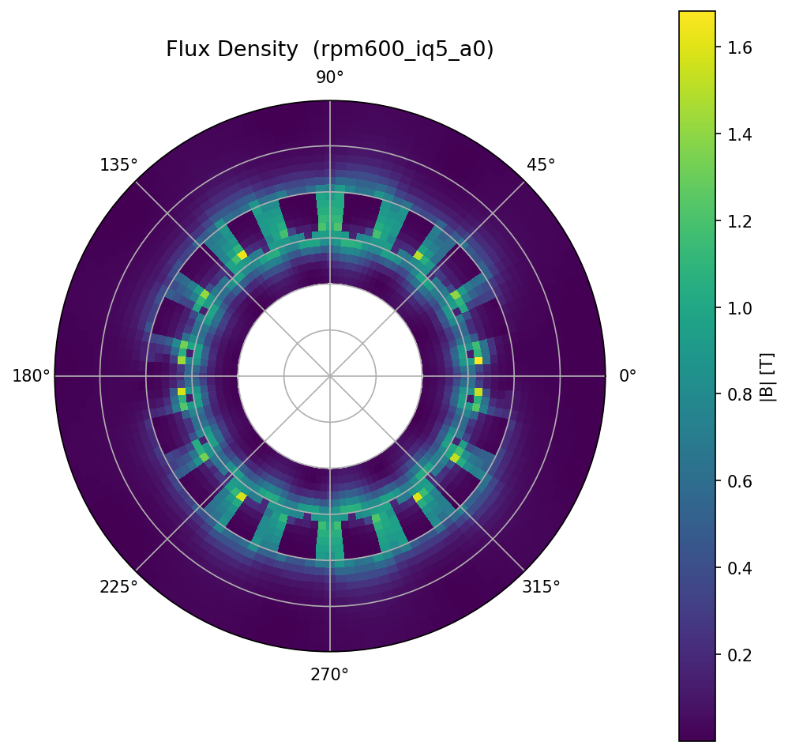
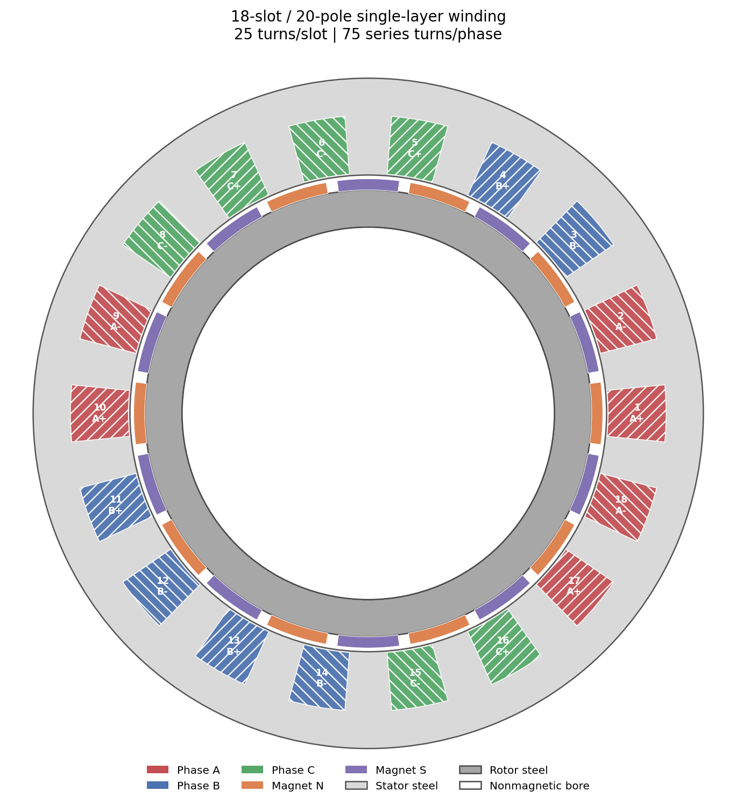
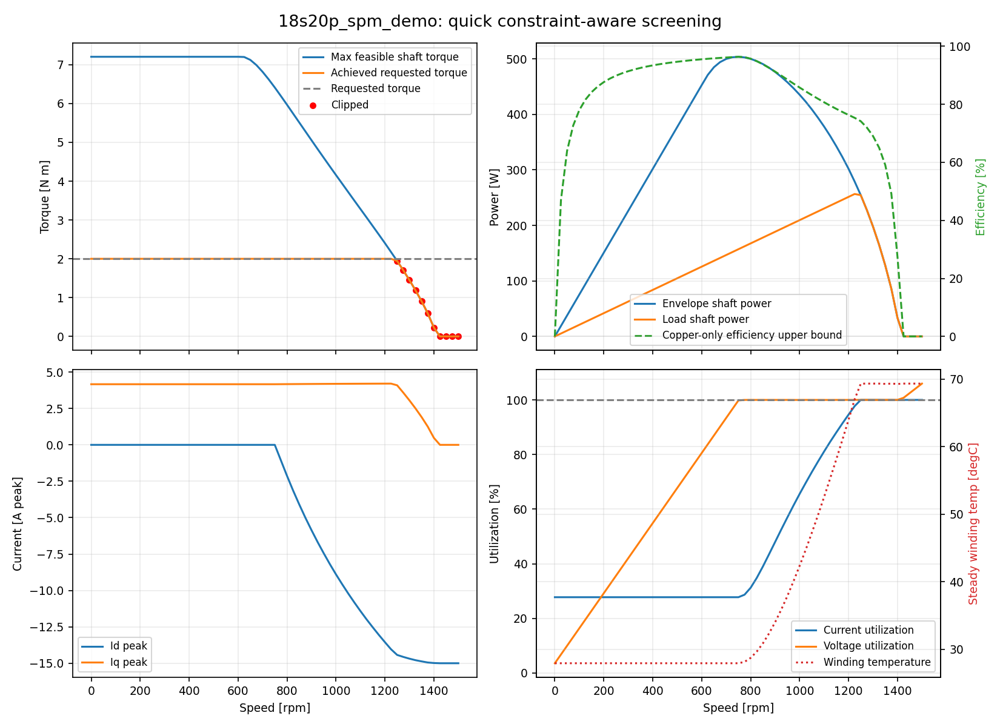
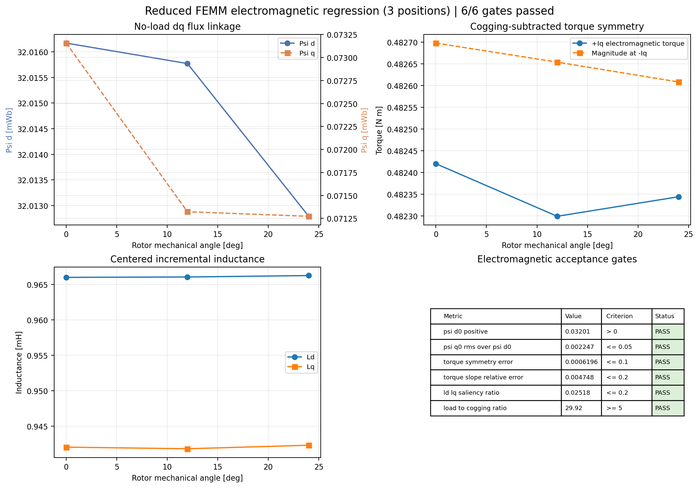
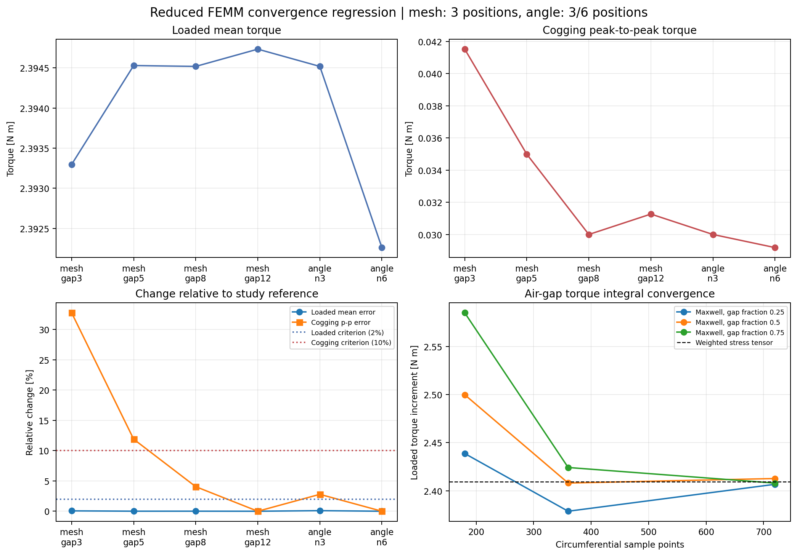
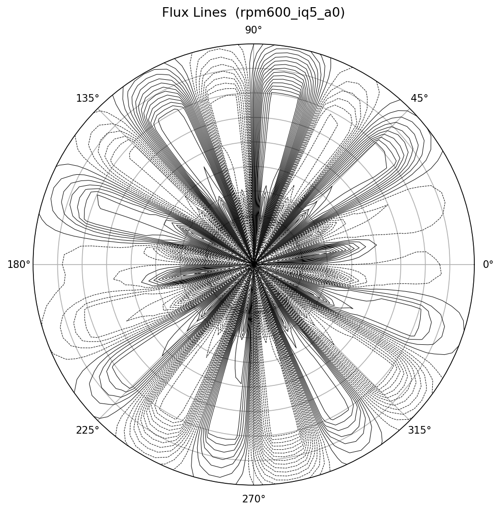
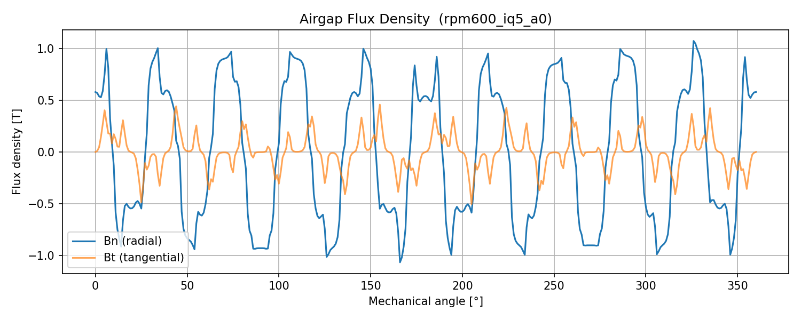

# 18-Slot / 20-Pole PMSM Screening and FEMM Validation

[中文说明](README_zh.md)

This repository contains a simple, shared-configuration workflow for an
18-slot / 20-pole surface PMSM:

- `design_pmsm.py` performs fast, constraint-aware steady-state dq screening.
- `femm_spm_template.py` builds the 2-D FEMM geometry and performs electromagnetic
  acceptance and numerical-convergence checks.
- Both paths read the strict SI-unit configuration in
  [`motor_config.json`](motor_config.json).

The image below is a fresh medium-mesh FEMM snapshot at `Id = 0`,
`Iq = 5 A peak`, and `0 deg` mechanical rotor angle. The `600 rpm` value is
context metadata only; speed does not change a magnetostatic FEMM solution.



## Current Status

The rotor, 18-slot winding, Park transform, phase sequence, and electrical-angle
zero are now defined by one convention. The current reduced regressions pass all
6 electromagnetic gates and all 9 convergence gates. These regressions are
useful checks, but they are not a production design sign-off.

The previous figures under `output_femm/` were generated by an older model and
are no longer referenced here. In particular, the old `33 mH` inductance,
`0.01 N m` at `15 A`, and `20 deg` cogging sweep are inconsistent with the
current model. All README image links now point to `docs/assets/`.

## Quick Start

Create the Python environment:

```powershell
conda create -n motor python=3.11 -y
conda activate motor
pip install -r requirements.txt
```

Run the default quick screening sweep:

```powershell
.\motor.bat quick
```

Run a sweep restricted to the presently validated `5 A peak` range:

```powershell
.\motor.bat quick --current-limit 5 --torque 2 --max-rpm 1000
```

Run all unit tests:

```powershell
.\motor.bat test
```

Run the short FEMM electromagnetic smoke check on Windows:

```powershell
.\motor.bat femm-validate
```

The launcher searches for Python in this order: explicit `-PythonExe`, repository
`.venv`, the existing `motor` Conda environment, then a tested Python on `PATH`.
All launcher paths are based on the repository directory, so it can be called
from another working directory.

## Validated Configuration

| Item | Current value |
|---|---:|
| Slots / poles / pole pairs | `18 / 20 / 10` |
| Winding | single layer, wye, 3 series coils per phase |
| Turns | `25` per slot, `75` series turns per phase |
| Fundamental winding factor | `0.9452136366` |
| Stack length | `80 mm` |
| Shaft / rotor radii | `20 / 30 mm` |
| Magnet thickness / air gap | `1.5 / 0.5 mm` |
| Stator outer radius | `60 mm` |
| PM flux linkage `psi_pm` | `0.03201491158 Wb` |
| Incremental `Ld / Lq` | `0.966089 / 0.942068 mH` |
| Phase resistance at 20 deg C | `0.22 ohm` |
| DC bus / modulation limit | `48 V / 0.95` |
| Phase-voltage peak limit | `26.3272 V` |
| Configured current limit | `15 A peak` |
| FEMM-supported parameter range | through `5 A peak` |

The winding generated from the actual FEMM slot table is shown below. Each phase
has three positive and three negative coil sides, balanced fundamental magnitude,
and 120 electrical-degree separation.



## Electrical Convention

All dq and phase currents are peak quantities. For a sinusoidal phase current,
`I_rms = I_peak / sqrt(2)`. The shared convention is:

- Phase sequence: `A-B-C`.
- Positive `Iq` produces positive torque.
- At mechanical angle `theta_m = 0`, the no-load PM flux lies on positive d.
- With angles in degrees, `theta_e = -10 * theta_m - 100 deg`.
- The inverse Park transform uses
  `i_phase = Id*cos(theta_phase) + Iq*sin(theta_phase)`.

The negative electrical-angle sign follows the rotor rotation used by the FEMM
geometry. Changing any one of these signs independently invalidates the reported
acceptance results.

## Current Results

### Quick dq Screening

The default result uses the configured `15 A peak` drive limit and a requested
shaft torque of `2 N m`. Values above `5 A` are electromagnetic extrapolations,
and the CSV marks them with `load_extrapolated` and `envelope_extrapolated`.

| Metric | Result | Interpretation |
|---|---:|---|
| No-load, `Id=0` voltage base speed | `785.28 rpm` | analytical voltage limit |
| Grid-estimated constant-torque base speed | `650 rpm` | 25 rpm sweep spacing |
| Highest feasible `2 N m` sweep point | `1225 rpm` | later points are clipped |
| Low-speed maximum shaft torque | `7.203 N m` | extrapolated to 15 A |
| Peak envelope shaft power | `503.68 W` | extrapolated to 15 A |
| Maximum dq/system power residual | `1.56e-13 W` | numerical closure |



The efficiency curve is explicitly a copper-only upper bound. Core, magnet,
mechanical, and inverter losses are not calibrated in the supplied configuration.
The temperature curve is a steady thermal-resistance estimate, not a transient.

### Electromagnetic Acceptance

The reported regression uses a medium mesh, `Iq = +/-1 A peak`, a centered
`delta-I = 1 A` perturbation, and 3 rotor positions over one electrical cycle.
Cogging torque is subtracted at the same rotor angle before torque symmetry and
slope are evaluated.

| Gate | Measured result | Limit | Status |
|---|---:|---:|:---:|
| Positive no-load `psi_d0` | `32.0149 mWb` | `> 0` | PASS |
| `rms(psi_q0) / psi_d0` | `0.22465%` | `<= 5%` | PASS |
| `T(+Iq)` versus `-T(-Iq)` error | `0.06196%` | `<= 10%` | PASS |
| Torque slope | `0.482504 N m/A` versus theory `0.480224 N m/A`; error `0.47479%` | `<= 20%` error | PASS |
| Incremental `Ld / Lq` difference | `2.5178%` | `<= 20%` | PASS |
| Loaded torque / cogging torque | `29.92` | `>= 5` | PASS |

The theoretical slope is `1.5 * p * psi_pm`. The plot below shows the actual
no-load dq alignment, cogging-subtracted positive/negative-current torque, and
centered incremental inductances.



### Torque Convergence

The checked-in convergence result is deliberately a reduced regression:
3 positions for each air-gap mesh, followed by 3- and 6-position angle sweeps.
It also compares periodic 180/360/720-point Maxwell integrations at three radii
against FEMM weighted-stress-tensor torque.

| Gate | Measured change or ratio | Limit | Status |
|---|---:|---:|:---:|
| Loaded torque, air-gap mesh | `0.01188%` | `<= 2%` | PASS |
| Loaded torque, angle step | `0.09618%` | `<= 2%` | PASS |
| Cogging peak-to-peak, mesh | `7.8536%` | `<= 10%` | PASS |
| Cogging peak-to-peak, angle step | `6.3781%` | `<= 10%` | PASS |
| Loaded torque / cogging | `75.91` | `>= 5` | PASS |
| Loaded torque / remesh noise floor | `658.36` | `>= 20` | PASS |
| Maxwell quadrature change | `0.15081%` | `<= 2%` | PASS |
| Maxwell radius spread | `0.12310%` | `<= 5%` | PASS |
| Maxwell versus WST | `0.10909%` | `<= 10%` | PASS |

Thus loaded torque is clearly larger than both cogging torque and numerical
remeshing noise in this regression.



### Reproducible Field Snapshot

The current README field figures use one explicit medium-mesh operating point:

| Quantity | Value |
|---|---:|
| Context speed | `600 rpm` |
| Mechanical rotor angle | `0 deg` |
| `Id / Iq` | `0 / 5 A peak` |
| FEMM torque | `2.412079 N m` |
| `psi_d / psi_q` | `0.0320233 / 0.00476648 Wb` |
| Field-map samples | `24 radial x 120 angular` |
| Air-gap samples | `360 angular` |

The nonzero loaded `psi_q` is the q-axis inductive flux; the `psi_q0` acceptance
gate above is evaluated at zero current.





## FEMM Commands

Install FEMM 4.2 and register its COM server from an Administrator CMD if needed:

```bat
"C:\FEMM42\femm.exe" /regserver
```

Generate the exact field snapshot used by this README:

```powershell
python .\femm_spm_template.py `
  --config .\motor_config.json `
  --analysis field airgap `
  --rpm-list 600 --iq-list 5 `
  --snapshot-angle-deg 0 `
  --field-radial-points 24 --field-angular-points 120 `
  --airgap-points 360 --mesh-level medium --workers 1 `
  --out .\output_readme_femm
```

Reproduce the checked-in reduced acceptance and convergence tables:

```powershell
python .\femm_spm_template.py `
  --config .\motor_config.json `
  --analysis validate convergence `
  --mesh-level medium `
  --validation-iq 1 --validation-delta-current 1 --validation-steps 3 `
  --convergence-iq 5 --convergence-mesh-points 3 `
  --convergence-angle-points "3,6" `
  --out .\output_femm_fix_smoke
```

Run one full electrical-cycle waveform within the validated current range:

```powershell
python .\femm_spm_template.py `
  --analysis basic --rpm-list 600 --iq-list 5 `
  --points 72 --mesh-level medium --out .\output_femm_basic
```

Run dedicated cogging or incremental-inductance sweeps:

```powershell
python .\femm_spm_template.py --analysis cogging --cogging-steps 72 --out .\output_femm_cogging
python .\femm_spm_template.py --analysis inductance --ind-current 1 --ind-steps 37 --out .\output_femm_inductance
```

Use a new output directory for a new study. The CLI writes a resolved configuration
but does not delete unrelated files from an existing output directory.

### Analysis Types

| Name | Purpose | Main outputs |
|---|---|---|
| `basic` | imposed-current torque/loss samples over one electrical cycle | `femm_waveforms_*.csv/.png`, `femm_summary.csv` |
| `field` | one explicit-angle flux-density and flux-line snapshot | `field_snapshot_*.csv`, `field_density_*.png`, `field_lines_*.png` |
| `airgap` | one explicit-angle air-gap `Bn/Bt` snapshot | `airgap_B_*.csv/.png` |
| `cogging` | zero-current torque over one true cogging period (`2 deg`) | `cogging_torque.csv/.png` |
| `inductance` | centered incremental `Ld/Lq` sweep | `inductance.csv/.png` |
| `validate` | dq alignment, torque symmetry/slope, `Ld/Lq`, load/cogging gates | electromagnetic acceptance CSVs |
| `convergence` | air-gap mesh, angle step, and Maxwell/WST convergence | torque-convergence CSVs |
| `emap` | raw imposed-current electromagnetic map | experimental; not shown in README |
| `tncurve` | comparison based on raw map maxima | experimental; not shown in README |
| `all` | every analysis, including long and experimental studies | not recommended for routine use |

Raw FEMM rpm/Iq points impose current directly; they are not filtered by the
48 V inverter voltage ellipse. Use the quick dq model to check reachability.

### Runtime and Solve Counts

FEMM runtime is machine dependent. On the current Windows machine, the single
README snapshot took about `3 min 28 s`, including geometry construction and
plot sampling. Solve counts are a better planning measure:

| Study | Approximate FEM solves |
|---|---:|
| field + air-gap snapshot | `1` |
| basic, one case at 72 points | `72` |
| cogging at 72 points | `72` |
| inductance at 37 positions | `185` (`5 x 37`) |
| validation at 3 positions, with equal test/delta current | `15` (`5 x 3`) |
| default raw emap | `192` (`4 x 4 x 12`) |

The checked-in reduced convergence run took about 3 hours and is resumable from
`.convergence_cache`. A production convergence run can take many hours.

## Regenerating README Assets

After the FEMM snapshot and acceptance CSVs exist, regenerate every README image
and its source manifest with:

```powershell
python .\generate_readme_assets.py `
  --femm-image-dir .\output_readme_femm `
  --femm-case-tag rpm600_iq5_a0
```

The generator uses a non-interactive Matplotlib backend, stable asset names, and
records source SHA-256 hashes, dimensions, and image hashes in
[`docs/assets/manifest.json`](docs/assets/manifest.json). Use `--skip-femm` only
when intentionally generating the quick, winding, acceptance, and convergence
figures without field images.

## Model Boundaries

- The quick path is a positive-speed, positive-torque steady-state screening
  model, not inverter switching, closed-loop FOC, mechanical dynamics, or a
  transient drive cycle.
- The reduced parameters are supported by the present FEMM checks through
  `5 A peak`. The configured `15 A peak` limit remains an extrapolation until a
  higher-current saturation and demagnetization study is completed.
- Additional losses are uncalibrated and zero in the supplied configuration.
  Efficiency is therefore a copper-only upper bound, and thermal values are
  screening estimates.
- FEMM studies are 2-D magnetostatic solutions. End windings, end effects,
  manufacturing tolerances, skew, transient eddy currents, rotor mechanical
  stress, and demagnetization margin are outside this model.
- The 3-position validation and reduced convergence data are regression checks.
  Increase angular resolution and validate against measurements before design
  release.

Always inspect the resolved configuration, extrapolation columns, acceptance
CSVs, and convergence CSVs before using a result downstream.

## Repository Map

```text
motor design/
  motor_config.json             shared authoritative configuration
  motor_config.py               strict schema, validation, and adapters
  design_pmsm.py                fast constraint-aware dq screening
  femm_spm_template.py          FEMM geometry and analysis workflows
  generate_readme_assets.py     reproducible documentation figures
  motor.bat / motor.ps1         recommended Windows launcher
  tests/                        pure-Python regression tests
  docs/assets/                  current README figures and hash manifest
  output_femm_fix_smoke/        checked-in reduced acceptance/convergence CSVs
  output_readme_femm/           source FEMM snapshot and metadata
```

## FEMM Troubleshooting

For `Invalid class string` or `femm.ActiveFEMM`, register FEMM and verify:

```bat
reg query HKCR\femm.ActiveFEMM
```

For list arguments in PowerShell, quote comma-separated values:

```powershell
python .\femm_spm_template.py --rpm-list "300,600,900" --iq-list "1,3,5"
```

Analysis names are validated; a misspelled `--analysis` value now exits with an
error instead of silently doing nothing.
