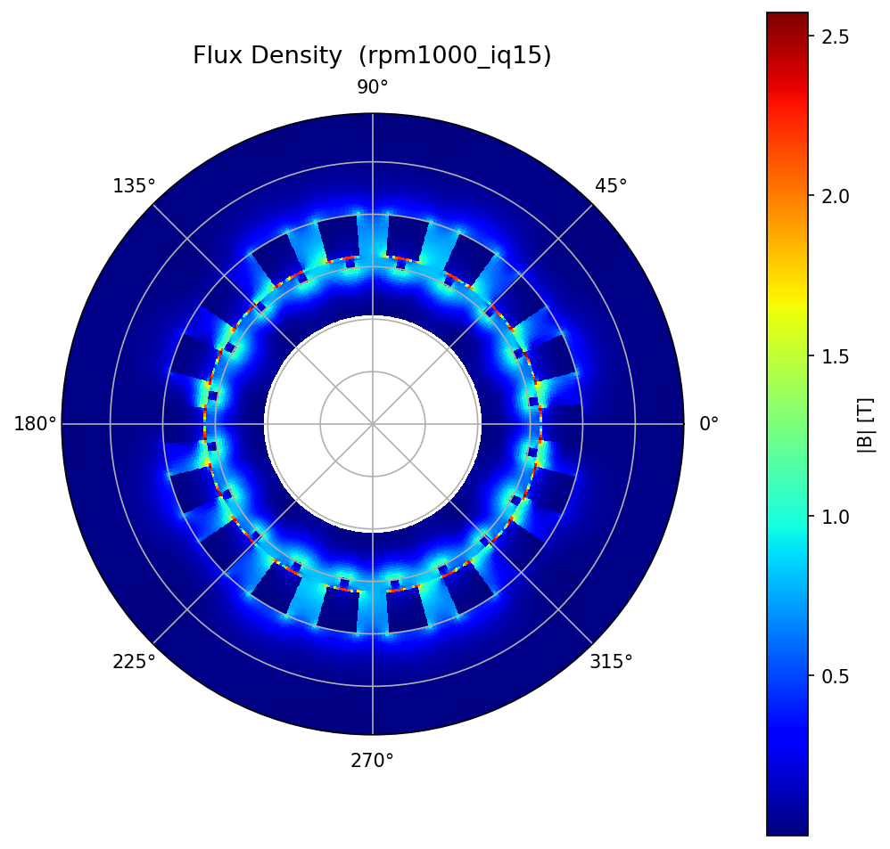
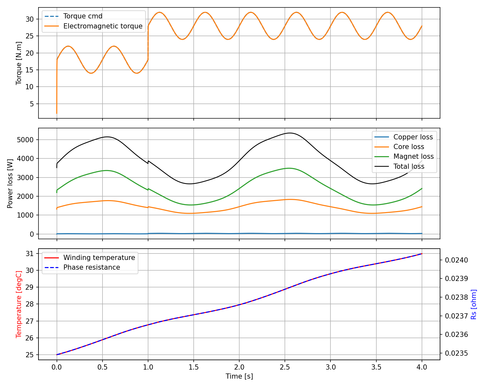
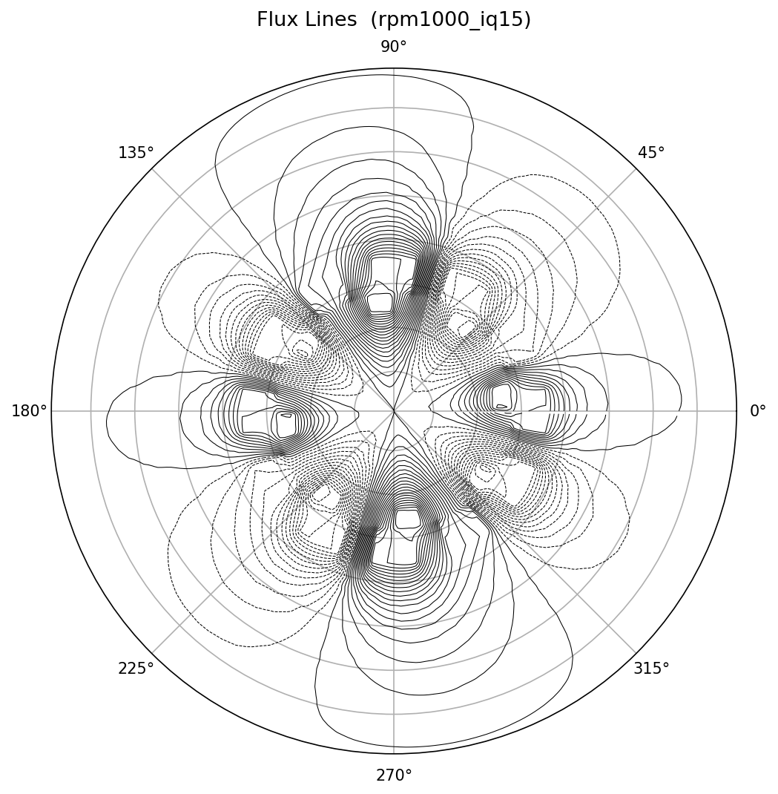
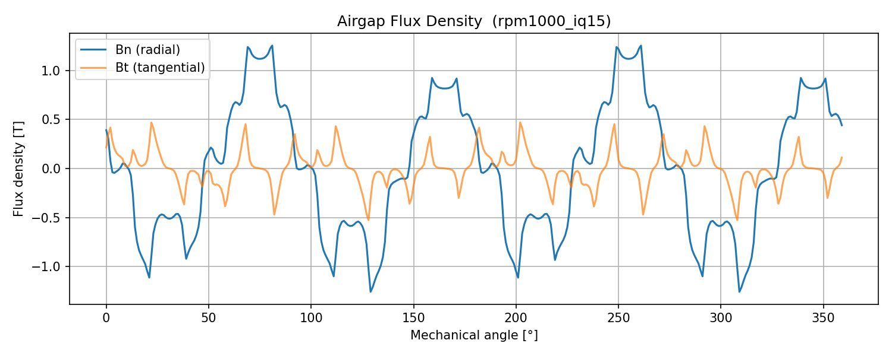
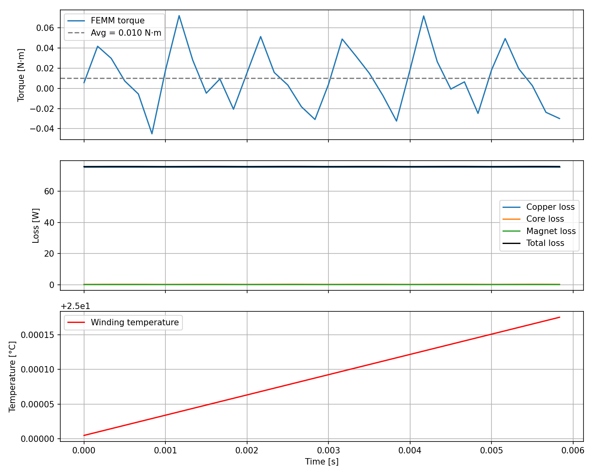
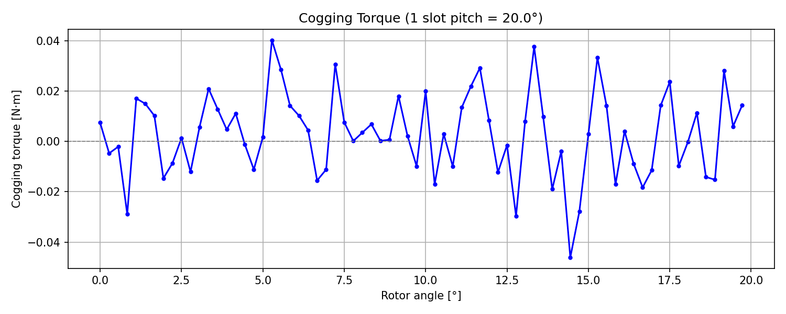
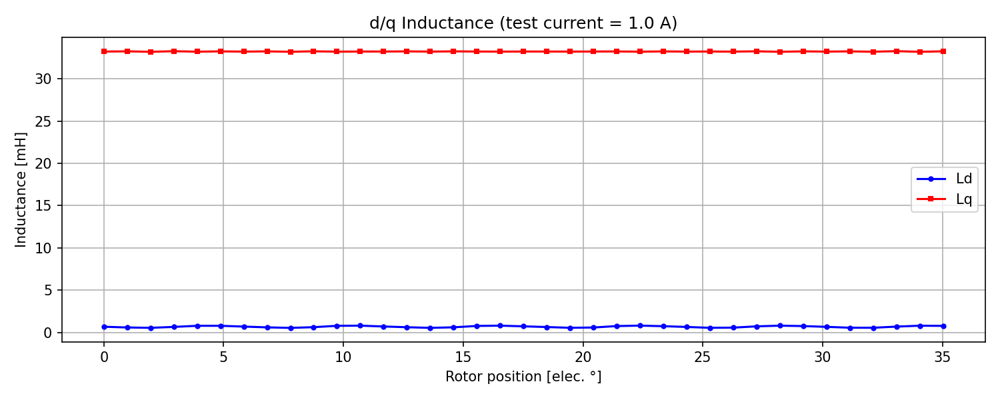
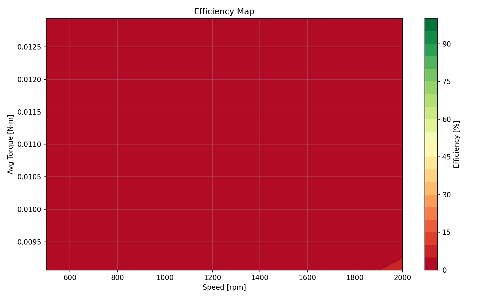
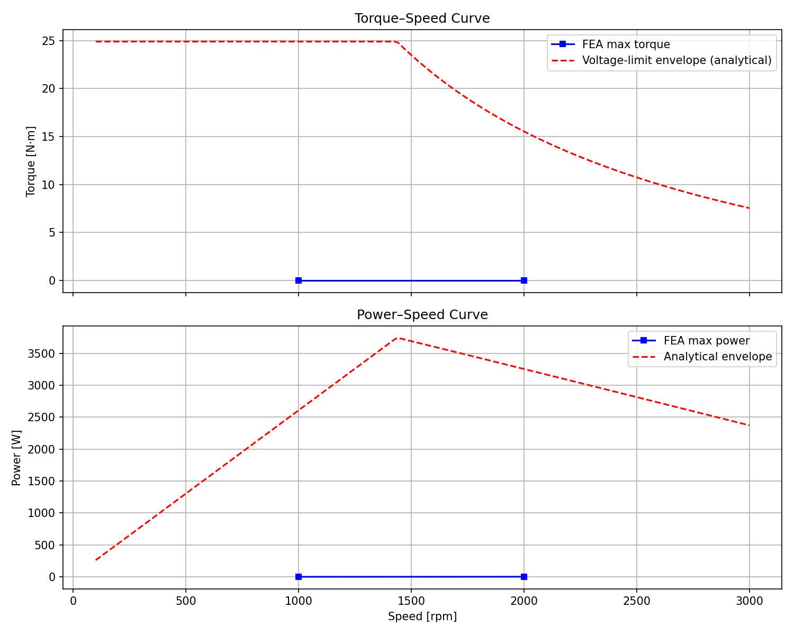

# 人形机器人关节电机 / PMSM 仿真项目

[English Version](README.md)

**一个专为机器人关节电机（robot joint motor）快速评估、有限元分析和控制系统集成设计的综合仿真工具包。**

本项目提供两条 **SPMSM**（表贴式永磁同步电机）的仿真路径，致力于打通电磁设计与控制仿真之间的壁垒，为 **MATLAB/Simulink** 或基于 Python 的控制开发提供支持。

## 🎯 适用场景
- **humanoid joint / actuator pre-design**（人形机器人关节 / 执行器前置设计）：电机评估、快速选型与电磁性能估算。
- **control simulation**（控制仿真）：提供基于 **dq model**（dq 轴模型）的 **FOC-ready model**（可随时用于 FOC 控制算法），加速算法验证。
- 生成用于系统级工程的 **torque-speed**（转矩-转速）曲线与效率特性。

## ✨ 仿真结果展示
*(示例：FEMM 等效电磁场磁密分布)*


## 🚀 5 分钟复现步骤

**1. 环境准备**
```powershell
conda create -n motor python=3.11 -y
conda activate motor
pip install -r requirements.txt
```

**2. 快速运行（基于 dq 模型）**
```powershell
python .\design_pmsm.py --save-csv --save-png --out .\output
# 或使用一键脚本：.\run.ps1
```

**3. FEMM 有限元分析（限 Windows 平台）**
- 安装 [FEMM 4.2](https://www.femm.info/wiki/Download)。
- 务必以管理员权限运行 CMD 注册 COM 服务器：
  ```bat
  "C:\FEMM42\femm.exe" /regserver
  ```
- 执行一次基础仿真：
  ```powershell
  python .\femm_spm_template.py --rpm-list "1000,1500" --iq-list "15,25" --out .\output_femm
  ```

---

## 📁 目录结构

```text
motor design/
  design_pmsm.py        ← 基于 dq 模型的快速 SPMSM 仿真
  femm_spm_template.py  ← 基于 FEMM 的 2D 有限元综合分析
  requirements.txt
  run.ps1 / run.bat
  README.md
  output/               ← dq 模型输出
  output_femm/          ← FEMM 有限元输出
```

## 🔍 FEMM 详细分析项与参数

通过 `--analysis` 参数选择要执行的分析（可同时选多项）：

| 分析项 | 说明 | 输出文件 |
|--------|------|----------|
| `basic` | 转矩/损耗/温升波形 | `femm_waveforms_*.png/.csv`, `femm_summary.csv` |
| `field` | 磁密云图 + 磁力线图 | `field_density_*.png`, `field_lines_*.png` |
| `airgap` | 气隙磁密分布（Bn/Bt） | `airgap_B_*.png/.csv` |
| `cogging` | 齿槽转矩曲线 | `cogging_torque.png/.csv` |
| `inductance` | Ld/Lq 电感参数 | `inductance.png/.csv` |
| `emap` | 效率 Map | `efficiency_map.png/.csv` |
| `tncurve` | 转矩-转速/功率-转速曲线 | `torque_speed_curve.png` |
| `all` | 以上全部 | 所有文件 |

### 运行示例

**只跑基本波形分析（默认）：**
```powershell
python .\femm_spm_template.py --rpm-list "1000,1500,2000" --iq-list "15,25,35" --out .\output_femm
```

**磁密云图 + 磁力线 + 气隙磁密（单工况）：**
```powershell
python .\femm_spm_template.py --analysis field airgap --rpm-list "1000" --iq-list "25" --out .\output_femm
```

**齿槽转矩分析：**
```powershell
python .\femm_spm_template.py --analysis cogging --cogging-steps 72 --out .\output_femm
```

**电感分析（Ld/Lq）：**
```powershell
python .\femm_spm_template.py --analysis inductance --ind-current 1.0 --ind-steps 37 --out .\output_femm
```

**效率 Map + 转矩-转速曲线：**
```powershell
python .\femm_spm_template.py --analysis emap tncurve --emap-rpm "500,1000,1500,2000,2500,3000" --emap-iq "5,10,15,20,25,30,35" --emap-pts 12 --out .\output_femm
```

**一次跑全部分析：**
```powershell
python .\femm_spm_template.py --analysis all --rpm-list "1000" --iq-list "15" --points 36 --emap-rpm "500,1000,2000" --emap-iq "10,20,30" --emap-pts 6 --out .\output_femm
```

### 常用参数

| 参数 | 默认值 | 说明 |
|------|--------|------|
| `--analysis` | `basic` | 选择分析项 |
| `--rpm-list` | `1000,1500,2000` | 转速列表 (rpm) |
| `--iq-list` | `15,25,35` | 电流峰值列表 (A) |
| `--points` | `72` | 基本分析每电周期采样点 |
| `--out` | `output_femm` | 输出目录 |
| `--show` | off | 显示 matplotlib 图 |
| `--show-femm` | off | 显示 FEMM 界面 |
| `--emap-rpm` | `500,...,3000` | 效率 Map 转速列表 |
| `--emap-iq` | `5,...,35` | 效率 Map 电流列表 |
| `--emap-pts` | `12` | 效率 Map 每电周期采样点 |
| `--cogging-steps` | `72` | 齿槽转矩分析步数 |
| `--ind-steps` | `37` | 电感分析步数 |
| `--ind-current` | `1.0` | 电感分析测试电流 (A) |

### 运行时间参考

| 分析项 | 大致耗时 |
|--------|----------|
| basic (1 工况, 72 步) | 2 ~ 5 分钟 |
| field + airgap | 在 basic 基础上 +1 分钟 |
| cogging (72 步) | 2 ~ 5 分钟 |
| inductance (37 步 × 2 轴) | 3 ~ 8 分钟 |
| emap (6×7=42 工况, 12 步) | 15 ~ 40 分钟 |
| all（精简参数） | 10 ~ 20 分钟 |

> **提示：** 减少采样点可显著加速，如 `--points 12` 或 `--emap-pts 6`。

---

## 📊 大量仿真结果图集

### 4.1 dq 模型仿真波形


### 4.2 磁密云图
极坐标下截面 |B| 分布，颜色表示磁通密度大小。


### 4.3 磁力线图
等磁矢位 (Az) 线即为磁力线分布。


### 4.4 气隙磁密分布
沿气隙中线提取的径向分量 Bn 和切向分量 Bt。


### 4.5 电磁转矩 / 损耗 / 温升波形
一个电周期内的转矩波形、各项损耗及绕组温升。


### 4.6 齿槽转矩曲线
零电流条件下转子旋转一个槽距的转矩波动。


### 4.7 电感参数（Ld / Lq）
d 轴和 q 轴电感随转子位置的变化（SPM 电机 Ld ≈ Lq）。


### 4.8 效率 Map
转速 × 转矩平面上的效率等高线。


### 4.9 转矩-转速 / 功率-转速曲线
FEA 最大转矩点与解析电压约束包络线对比。


---

## 💡 说明

- `design_pmsm.py` 适合做控制与参数趋势的快速评估。
- `femm_spm_template.py` 更接近场路仿真，但当前仍是模板：
  - 槽型/绕组布置做了简化；
  - 铁耗/磁钢损耗为半经验模型；
  - 若用于工程定型，请替换为真实几何、材料与 B-H 曲线数据。

## 🛠 FEMM 故障排查

如果报错包含 `Invalid class string` 或 `femm.ActiveFEMM`，说明 FEMM COM 未注册。
以管理员权限打开 CMD 执行：

```bat
"C:\FEMM42\femm.exe" /regserver
```
检查是否成功：
```bat
reg query HKCR\femm.ActiveFEMM
```

如果 PowerShell 中运行报参数解析错误，请用引号包裹列表参数：

```powershell
python .\femm_spm_template.py --rpm-list "1000,1500,2000" --iq-list "15,25,35"
```
